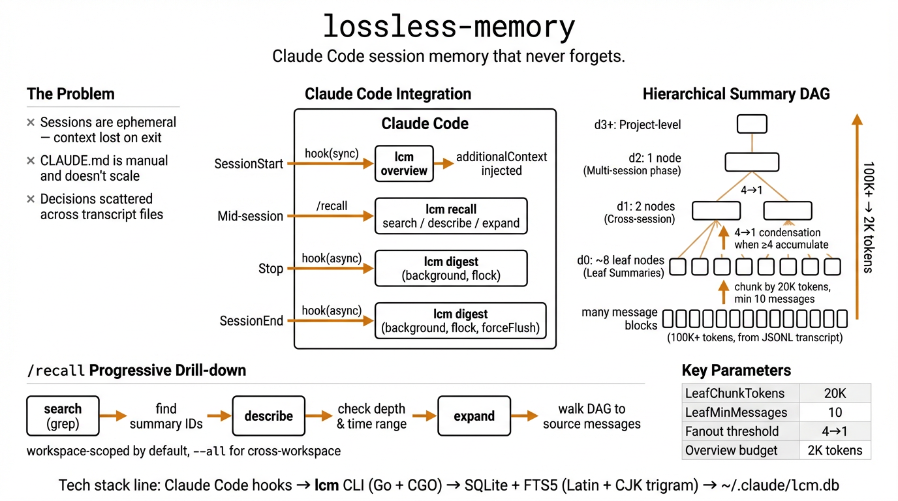

# lossless-memory

Claude Code session memory that never forgets.



## The problem

Claude Code conversations are ephemeral. Every session starts with a blank slate — previous decisions, debugging history, and project context are gone. The built-in context window compresses or drops older content as conversations grow, silently losing information you might need later.

You can write things into `CLAUDE.md` or memory files, but that's manual, selective, and doesn't scale. What you actually did across dozens of sessions — the decisions, the dead ends, the rationale — is scattered across transcript files that nobody reads.

## How lossless-memory solves it

**Nothing is thrown away.** Raw messages are stored verbatim in SQLite. Summaries compress upward through a DAG hierarchy, but every level stays reachable — you can always drill back down to the exact conversation that led to a decision.

Key design choices:

- **Hierarchical summary DAG** — not flat logs, not a single summary. Leaf summaries (depth 0) cover message chunks; they condense into cross-session summaries (depth 1), then into phase-level (depth 2), then project-level (depth 3+). Each level has a purpose-tuned prompt that knows what to keep and what to drop.
- **"Expand for details" pointers** — every summary ends with a compressed index of what was dropped. This lets targeted recall reconstruct detail on demand, without bloating the default context.
- **Automatic lifecycle hooks** — `SessionStart` injects the latest overview; `SessionEnd`/`Stop` triggers ingest + summarization in the background. Zero manual effort.
- **Workspace isolation with cross-workspace search** — recall is scoped to the current working directory by default, but `--all` searches across every project.
- **Full-text search with CJK support** — FTS5 for Latin, trigram tokenizer for CJK (auto-detected), regex mode for complex patterns. All searchable via `/recall` in Claude Code.

## Architecture

```
Transcript (JSONL)
      │
      ▼
  ┌────────┐     messages table
  │ ingest │────▶ + FTS index (Latin + CJK)
  └────────┘
      │
      ▼
  ┌────────────────┐
  │ leaf summaries │   depth 0 — chunk by 20k tokens, summarize each chunk (per session)
  └────────────────┘
      │  when ≥ 4 leaves accumulate (across all sessions in workspace)
      ▼
  ┌──────────────────┐
  │ condensed (d1)   │   cross-session: merge 4 leaves → 1 condensed
  └──────────────────┘
      │  when ≥ 4 at d1
      ▼
  ┌──────────────────┐
  │ condensed (d2+)  │   phase / project level, repeat until fanout < 4
  └──────────────────┘
      │
      ▼
  ┌──────────┐
  │ overview │   top 1–2 depth levels of summaries → injected into SessionStart hook
  └──────────┘
```

## Quick start

```sh
# 1. Build and install
make build && make install   # → ~/.local/bin/lcm

# 2. Configure LLM for summarization
export LCM_API_KEY=<your-key>
export LCM_API_BASE_URL=<openai-compatible-endpoint>
export LCM_MODEL=gpt-4o-mini   # optional, default gpt-4o-mini

# 3. Add hooks to ~/.claude/settings.json (see Hook configuration below)

# 4. Install recall skill
cp -r .claude/skills/recall ~/.claude/skills/recall   # global install
# or keep in project directory for project-level skill

# 5. Verify
lcm status --cwd "$(pwd)"
```

## Claude Code integration

lossless-memory integrates with Claude Code in two ways:

- **Hooks (automatic)** — session lifecycle events trigger ingest/digest/overview
- **Skill (user-invoked)** — `/recall` slash command to search and browse past memory

```
┌─────────────────────────────────────────────────────┐
│                   Claude Code                       │
│                                                     │
│  SessionStart ──hook──▶ lcm overview                │
│       │                    │                        │
│       │              additionalContext               │
│       ◀────────────────────┘                        │
│                                                     │
│  Mid-session ──/recall──▶ lcm recall search/describe/expand │
│                                                     │
│  SessionEnd ──hook──▶ lcm digest                    │
│  Stop       ──hook──▶ lcm digest                    │
└─────────────────────────────────────────────────────┘
```

### Hook configuration

Add to `~/.claude/settings.json` (global) or project-level `.claude/settings.json`:

```json
{
  "hooks": {
    "SessionStart": [
      {
        "matcher": "",
        "hooks": [
          {
            "type": "command",
            "command": "lcm overview"
          }
        ]
      }
    ],
    "SessionEnd": [
      {
        "matcher": "",
        "hooks": [
          {
            "type": "command",
            "command": "bash -c 'input=$(cat); printf \"%s\" \"$input\" | lcm digest &>/dev/null &'"
          }
        ]
      }
    ],
    "Stop": [
      {
        "matcher": "",
        "hooks": [
          {
            "type": "command",
            "command": "bash -c 'input=$(cat); printf \"%s\" \"$input\" | lcm digest &>/dev/null &'"
          }
        ]
      }
    ]
  }
}
```

| Hook event | Command | Sync/Async | Purpose |
|-----------|---------|:----------:|---------|
| `SessionStart` | `lcm overview` | Sync | Claude waits for `additionalContext` before starting |
| `SessionEnd` | `lcm digest` | **Async** | Session over, no need to block; `forceFlush` ensures remaining messages are summarized |
| `Stop` | `lcm digest` | **Async** | Refresh memory each time Claude stops responding, without blocking user input |

Async mechanism: `bash -c 'input=$(cat); printf "%s" "$input" | lcm digest &>/dev/null &'`
- `$(cat)` reads stdin immediately (small JSON payload)
- `printf ... | lcm digest` runs in background
- bash exits immediately (exit 0), Claude Code is not blocked

`lcm digest` uses `flock` (`~/.claude/lcm.lock`) for mutual exclusion. When multiple digests trigger concurrently (e.g. `Stop` followed by `SessionEnd`), the second process waits for the first to finish, preventing data loss.

Hook stdin/stdout JSON protocol:

**Input** (Claude Code → lcm):
```json
{
  "session_id": "sess_abc123",
  "transcript_path": "/Users/you/.claude/sessions/sess_abc123/transcript.jsonl",
  "cwd": "/Users/you/project",
  "hook_event_name": "SessionStart"
}
```

**Output** (lcm → Claude Code, `overview` only):
```json
{
  "hookSpecificOutput": {
    "hookEventName": "SessionStart",
    "additionalContext": "## Prior Session Context\n\n### [d2] 2026-04-10 to 2026-04-12\n- Implemented auth flow..."
  }
}
```

### Skill configuration (/recall)

Skill definition lives at `.claude/skills/recall/SKILL.md`, providing the `/recall` slash command for searching past memory during a session.

**Install**: copy `.claude/skills/recall/` to your project or `~/.claude/skills/recall/` for global access.

The skill exposes three tools:

| Tool | Command | Purpose |
|------|---------|---------|
| `lcm_grep` | `lcm recall search` | Full-text/regex search across messages and summaries |
| `lcm_describe` | `lcm recall describe` | Inspect summary details and parent/child lineage |
| `lcm_expand` | `lcm recall expand` | Walk the DAG downward to source messages |

**Progressive drill-down workflow**:

```
/recall "authentication changes"
    │
    ▼
  grep — find relevant summary IDs
    │
    ▼
  describe — check summary depth and time range
    │
    ▼
  expand — delegate to sub-agent to walk the DAG, preventing context overflow
```

For complex queries, the skill delegates expand operations to a sub-agent (Agent tool), preventing large result sets from flooding the main context window.

## Summary mechanism

### 1. Ingest

`lcm ingest` reads the Claude Code JSONL transcript **incrementally** (byte-offset tracking). Each message becomes a row in `messages` with an estimated token count. `tool_use` blocks are reduced to markers (`[tool_use: name]`); `tool_result` blocks are discarded entirely to save space.

### 2. Leaf summaries (depth 0)

Triggered by `lcm digest`. Uncovered messages in a session are chunked into groups of up to **20,000 tokens**. Each chunk is sent to an LLM with a compaction prompt that preserves decisions, rationale, file operations, and open work while stripping filler.

- Minimum **10 messages** to trigger (avoids summarizing half-finished work).
- On `SessionEnd`, **force-flush** summarizes whatever remains.
- Each leaf links back to its source message IDs via `summary_messages`.

### 3. Condensation (depth 1+)

After leaves are created, `RunCondensation` walks upward **across all sessions in the workspace**:

```
for depth = 0, 1, 2, …:
    unconsumed = summaries at this depth not yet rolled up
    if len(unconsumed) < 4: break
    group into chunks of 4
    summarize each chunk → new summary at depth+1
    link via summary_parents
```

Each depth has a purpose-tuned prompt:

| Depth | Scope | Keeps | Drops |
|-------|-------|-------|-------|
| 0 (leaf) | Message chunk | Decisions, file ops, active tasks | Filler, repetition |
| 1 | Cross-session | Chronological timeline, superseded decisions | Dead-end explorations |
| 2 | Multi-session phase | Trajectory, evolved decisions | Per-session operational detail |
| 3+ | Project arc | Durable lessons, key constraints | Method details, stale references |

Every summary ends with `"Expand for details about: ..."` — a compressed pointer to what was dropped, enabling targeted recall.

### 4. Overview injection

`lcm overview` selects summaries from the top 1–2 depth levels (up to 2,000 tokens) and formats them as markdown. When the highest depth is ≥ 2, it includes both the highest and second-highest depth for more detail. The SessionStart hook injects this into the new conversation as `additionalContext`, giving the model a warm start.

### 5. Recall

`lcm recall` provides three operations for drilling back down:

- **search** — FTS5 full-text search across messages and summaries.
- **describe** — Show a summary with its parent/child lineage.
- **expand** — Walk the DAG from any summary down to source messages.

Recall searches cross all sessions, but is **workspace-scoped by default** (filtered by `--cwd`). Pass `--all` to search across all workspaces in the database.

## Search features

The search engine supports multiple modes and backends:

| Mode | Backend | Best for |
|------|---------|----------|
| `full_text` (default) | FTS5 | Latin text, fast ranked search |
| `full_text` | FTS5 CJK trigram | Chinese/Japanese/Korean (auto-detected) |
| `full_text` | LIKE fallback | Short CJK queries (<3 runes) or trigram miss |
| Wildcard (`*`, `%`) | LIKE | Partial matches |
| `regex` | Go regexp | Complex patterns (scans up to 10K rows) |

Sort modes: `relevance` (FTS5 rank), `recency` (newest first), `hybrid` (rank decayed by time).

CJK detection covers Unicode ranges for CJK Unified Ideographs, Hiragana, Katakana, and Hangul. Token estimation uses 1 rune ≈ 1 token for CJK vs 4 chars/token for ASCII.

## CLI reference

```
lcm <command> [args]
```

| Command | Description |
|---------|-------------|
| `ingest` | Parse Claude Code JSONL transcript, store messages incrementally (reads hook JSON from stdin) |
| `digest` | Ingest + create leaf summaries + run condensation (reads hook JSON from stdin) |
| `overview` | Generate SessionStart context from highest-depth summaries (reads hook JSON from stdin) |
| `recall search` | Full-text search across messages and summaries |
| `recall describe` | Show a summary with its parent/child lineage |
| `recall expand` | Walk the DAG from any summary down to source messages |
| `status` | Show workspace statistics (message/session/summary counts) |

```sh
lcm recall search --cwd <path> --query <text> \
    [--mode full_text|regex] \
    [--scope messages|summaries|both] \
    [--sort relevance|recency|hybrid] \
    [--since <datetime>] [--before <datetime>] \
    [--all] [--limit N]

lcm recall describe --id <sum_xxx>
lcm recall expand  --id <sum_xxx> [--max-depth N] [--include-messages]

lcm status --cwd <path>
```

## Key thresholds

| Constant | Value | Role |
|----------|-------|------|
| `LeafChunkTokens` | 20,000 | Max tokens per leaf's source |
| `LeafMinMessages` | 10 | Min messages before leaf creation |
| `LeafMinFanout` | 4 | Leaves needed to trigger d0→d1 |
| `CondensedMinFanout` | 4 | Summaries needed for d(n)→d(n+1) |
| `maxOverviewTokens` | 2,000 | Token budget for SessionStart injection |

## Configuration

```sh
LCM_API_KEY=<key>                 # LLM API auth (required for digest)
LCM_API_BASE_URL=<base-url>      # OpenAI-compatible endpoint
LCM_MODEL=gpt-4o-mini            # Model (default: gpt-4o-mini)
```

Database is stored at `~/.claude/lcm.db` (SQLite with WAL mode).

## Build & install

```sh
make build     # → ./lcm (requires CGO for SQLite FTS5)
make install   # → ~/.local/bin/lcm
make test      # run tests
make clean     # remove binary and database
```

Requires `CGO_ENABLED=1` — the SQLite FTS5 extension is compiled in via `CGO_CFLAGS="-DSQLITE_ENABLE_FTS5"`.
